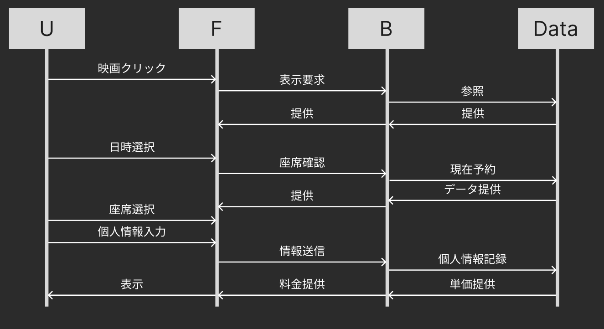

## 映画チケット販売システム
### 中間課題の内容
#### ❶「購入者情報」（会員か非会員か、氏名）
#### ❷「チケット情報」（購入する映画館のタイトル、鑑賞日付）
#### ❸「購入チケット区分(単価)と区分ごとの購入枚数」（購入区分<例えば、大人料金等>、合計枚数）
#### ❹「支払い料金の合計金額」（支払金額の合計）

### colabで動かすために


### 振り返り
1. 自分なりに考えた ❶～❹以外の追加機能についての説明

第一に、UIをcolabの外に置き、Webアプリケーション風にした。その際、FastAPIとHTMLを使用し、極力現実世界に近づける努力をした。
<br>
座席選択機能を追加し、CSVでデータを管理できるようにした。

2. このコードを実際に納品した時、現場の人たちからさらなる改良を求められるとしたらどんな内容だと思うか

デザインがチープ。ブランドイメージというものを持たないため、このページでないといけない理由が薄い。
<br>
15歳未満のR-15映画の視聴を拒否するタイミングが遅い。resultに遷移する前に教えてほしい。
<br>
ユーザ情報の保存をしてほしい。そのうえでcsvはセキュリティとか何とかに不安があるのでちゃんとしたDBにしてほしい。


3. 生成AIに書いてもらって、自分では思いつかなかったコードについて。どこが参考になったか※100文字以上

フロント部分は数文字しか自分で書いて居らず、デザインしたサンプル画像とか、当README、シーケンス図を渡して作成してもらった。自分の作りたかった物が、形になるさまは面白い。
<br>
バックは、「オブジェクト指向にしたいんですけど、こんな書き方していいですか？」みたいな質問を重ねて作成した。あってるけど、こうしたらきれいだよ！と一般的な広い知見からものを言ってもらえるのが助かった。

-----

### ペルソナ
#### 大学メンバー
- 20代
- サクッと映画をみたい

### ユーザーフロー
1. 映画を選ぶ
2. 日時選択
3. 座席選択
4. 情報入力orログイン
5. お支払い
6. チケット提示
7. レビュー投降

-----

### 機能要件
- 情報入力
    - **購入者情報**（会員か非会員か、氏名）:H
    - **チケット情報**（映画タイトル、鑑賞日時）:H
    - **購入チケット区分(単価)と区分ごとの購入枚数**:H
    - 座席選択:M

- 情報出力
    - **支払い料金の合計金額**:H
    - 提示可能なQRコード:L

- ホームページ
    - LP:H
    - 映画一覧:M
    - 座席選択画面:M
    - お支払い画面:M
    - ログイン画面:L
    - 年齢制限:M

- ユーザー情報
    - ログイン:L
    - ログアウト:L
    - 鑑賞履歴:L
    - 鑑賞回数:M

- データ管理
    - 購入履歴の一時保存:H
    - 映画・座席データの管理:M
    - 会員データの参照:M 

- 環境
    - google colabから動かせる:H
    - 簡単に保守ができる:M

### 非機能要件
- 見た目
    - 詰まらないUX:M

-----

### 技術アーキテクチャ

#### フロント
HTML
#### バック
FastAPI
#### データ管理
CSV

-----

### シーケンス図


### ディレクトリ構成予定
```
MovieTikets/
├── templates/           # フロントエンド
│   ├── index.html       # 映画選択
│   ├── booking.html     # 情報入力
│   └── ressult.html     # 結果表示 
├── docker-compose.yml   # コンテナ起動設定
├── Dockerfile           # 環境構築設定
├── static/images        # 画像置き
├── main.py              # バックエンド
├── models.py            # クラス
├── requirements.txt     # ライブラリ一覧
└── README.md            # 説明書
```